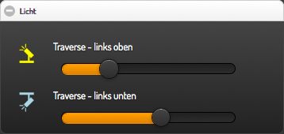
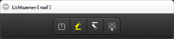

### Basic Device Widgets for smartVISU / FHEM

**Version: 0.1**

**Screenshots:**





**Description:**
- dimmer with own icon and own highlighted color
- switch with own color like symbol in sv 2.8pre
- dual switch which behaves like dual switch in sv version 2.7


**Requirements:**
- SmartVISU 2.8+ (https://github.com/Martin-Gleiss/smartvisu)


**Installation advices:**
- Copy widget_ddtlabs_(device|basic).* to your smartVISU pages folder.
- Copy content of *.css and *.js to your visu.css/visu.js or include it in any other way.
- Check that permissions of all copied files are correct.


**Widgets declaration:**
```



```

**Example widget calls:**
```

{{ ddtlabs_basic.switch('id_switch', 'item', 'light_light.svg', 'light_light.svg', 'on', 'off', '#00ff00') }}
{{ ddtlabs_basic.dual('id', 'item', 'pic_on', 'pic_off', 'val_on', 'val_off', 'mini', '#0F0') }}


{{ ddtlabs_device.dimmer('id_lamp', 'lamp_description',  'lamp.sw', 'lamp.pct', 0, 100, 1, 'light_spot06_up_r.svg', 'light_spot06_up_r.svg', 'red') }}

```


**Note** on using "ddtlabs" in file names and css statements:
- I decided to use a unique prefix name to be sure to not collide with other widgets.


**Change log:**
- none


**Have fun.**
