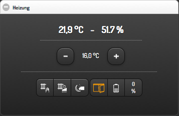
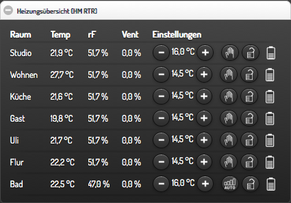

### Homematic Widgets for smartVISU / FHEM

**Version: 0.1**

**Screenshots:**





**Description:**
- SmartVISU widgets to control Homematic RTRs and list overview.

**Requirements:**
- Fully functioning FHEM with configured HM rtr devices.
- SmartVISU 2.8+ (http://www.smartvisu.de/)

**Installation advices:**

**FHEM**
- Add 2 userReadings to you RTR device (main channel). Replace <your_rtr> with your device name.
```
attr <your_rtr> userReadings onState:actuator {(ReadingsVal($name,"actuator","0")>0?1:0)}, batteryLevelx10:batteryLevel {(ReadingsVal($name,"batteryLevel","0"))*10}
```

**smartVISU:**
- Copy widget_ddtlabs_hm.* and widget_ddtlabs_icon.* to your smartVISU pages folder.
- Copy icons/* to smartVISU icons folder (typically /var/www/smartvisu/icons)
- Copy content of *.css and *.js to your visu.css/visu.js or include it in any other way.
- Check that permissions of all copied files are correct.


**Widget declaration:**
```


```


**Example widget call** (eg. for rooms_*.html):
```


<div class="block">
	<div class="set-1" data-role="collapsible-set" data-theme="c" data-content-theme="a" data-mini="true">
		<div data-role="collapsible" data-collapsed="false" >
		<h3>Heizung</h3>
		<table width="100%">
			<tr><td> {{ ddtlabs_hm.rtr('WZ_RTR', 'WZ_RTR', 'WZ_RTR.humidity', 0.5) }}</td></tr>
		</table>
		</div>
	</div>
</div>

<div class="block" style="width: 100%; min-width: 480px;">
	<div class="set" data-role="collapsible-set" data-theme="c" data-content-theme="a" data-mini="true">
		<div data-role="collapsible" data-collapsed="false" >
		<h3>Heizungsübersicht (HM RTR)</h3>
		<table style="width: 100%;">
			<tr><td> {{ ddtlabs_hm.rtr_list('RTR_LIST', [['ST_RTR','Studio'],['WZ_RTR','Wohnen'],['KU_RTR','Küche'],['SG_RTR','Gast'],['SU_RTR','Uli'],['FL_RTR','Flur'],['BA_RTR','Bad']],'with-humidity','with-valve') }}</td></tr>
		</table>
		</div>
	</div>
</div>

```


**Fronthem converter usage:**

| item                    | reading         | converter       | cmd set      |
| ----------------------- | --------------- | --------------- | ------------ |
| RTR.R-btnLock           | R-btnLock       | Direct          | regSet       |
| RTR.batteryx10          | batteryLevelx10 | Direct          |              |
| RTR.humidity            | humidity        | NumDisplay      |              |
| RTR.state               | onState         | NumDisplay      |              |
| RTR_Clima.controlMode   | controlMode     | Direct          | controlMode  |
| RTR_Clima.desired-temp  | desired-temp    | NumDirect 5, 30 | desired-temp |
| RTR_Clima.measured-temp | measured-temp   | NumDisplay      |              |
| RTR_Clima.valve         | ValvePosition   | NumDisplay      |              |
| WIN.windows             | state           | Direct          |              |


**Uninstall:**
- Remove additional userReadings
- Delete all copied files.


**Note** on using "ddtlabs" in file names and css statements:
- I decided to use a unique prefix name to be sure to not collide with other widgets.


**Change log:**
- none


**Have fun.**


