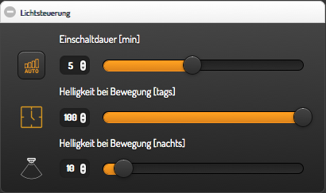

### Motion Detection Widget for smartVISU / FHEM

Screenshots:




Installation hints:

- tested only with smartVISU **2.8 pre** !
  - https://github.com/Martin-Gleiss/smartvisu

- Copy widget_md.html to your pages folder

- Copy icons to $smartvisu_root/icons/my/(ws|or)/ (SV 2.8 does not deal with png icons anymore, USZU 3.01 still needs them)


Optional:

- Have a look at 99_myMdUtils.pm to get an idea how it **can** be used with FHEM


Requirement:

- UZSU Widget (tested with v3.0.1)
  - https://github.com/mworion/uzsu_widget/


Code for your room.html or category.htm:

```


<div class="block">
	<div class="set-1" data-role="collapsible-set" data-theme="c" data-content-theme="a" data-mini="true">
		<div data-role="collapsible" data-collapsed="false" >
		<h3>Lichtsteuerung</h3>
		{{ md.md('ba_md', 'BA_MD') }}
		</div>
	</div>
</div>

```

