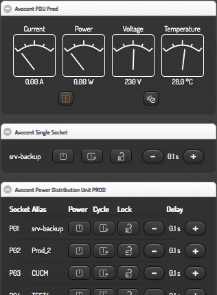

### Power Distribution Unit Widget for smartVISU
Designed for use with with [Avocent PDUs](https://github.com/ddtlabs/PM20) or [NETIO230 PDUs](https://github.com/ddtlabs/NETIO230). But any other type of ports/sockets can be switched also.

**Version: 0.11**

**Screenshots:**



**Description:**
- SmartVISU widget to control Power Distribution Units (PDUs).

**Main features:**
- Power sockets on/off, cycle sockets, lock sockets, set power on delay
- Display current, voltage, power, temperature

**Requirements:**
- SmartVISU **2.8+** (https://github.com/Martin-Gleiss/smartvisu)

**Installation advices:**
- Copy widget_ddtlabs_pdu.* to your smartVISU pages folder.
- Copy content of *.css and *.js to your visu.css/visu.js or [include it](https://github.com/ddtlabs/smartvisu-widgets/wiki/HowTo-Install-Widgets).
- Check that permissions of all copied/edited files are correct.

**Example widget calls:**
```


<div class="block" style="width: 50%; min-width: 480px;">
	<div class="set" data-role="collapsible-set" data-theme="c" data-content-theme="a" data-mini="true">
		<div data-role="collapsible" data-collapsed="false" >
		<h3>Avocent PDU Prod</h3>
		<table style="width: 100%;">
			<tr><td> {{ ddtlabs_pdu.PDU('PDU_PROD_ID2',['PM20C_PDU_PROD','']) }}</td></tr>
		</table>
		</div>
	</div>
</div>

<div class="block" style="width: 50%; min-width: 480px;">
	<div class="set" data-role="collapsible-set" data-theme="c" data-content-theme="a" data-mini="true">
		<div data-role="collapsible" data-collapsed="false" >
		<h3>Avocent Single Socket</h3>
		<table style="width: 100%;">
			<tr><td> {{ ddtlabs_pdu.socket('KE_SOCKET_1',['PM20C_PROD_01','']) }}</td></tr>
		</table>
		</div>
	</div>
</div>

<div class="block" style="width: 50%; min-width: 480px;">
	<div class="set" data-role="collapsible-set" data-theme="c" data-content-theme="a" data-mini="true">
		<div data-role="collapsible" data-collapsed="false" >
		<h3>Avocent Power Distribution Unit PROD</h3>
		<table style="width: 100%;">
			<tr><td> {{ ddtlabs_pdu.socketlist('KE_PDU1',
			[
			['PM20C_PROD_01','P01'],['PM20C_PROD_02','P02'],['PM20C_PROD_03','P03'],
			['PM20C_PROD_04','P04'],['PM20C_PROD_05','P05'],['PM20C_PROD_06','P06'],
			['PM20C_PROD_07','P07'],['PM20C_PROD_08','P08'],['PM20C_PROD_09','P09'],
			['PM20C_PROD_10','P10'],['PM20C_PROD_11','P11'],['PM20C_PROD_12','P12'],
			['PM20C_PROD_13','P13'],['PM20C_PROD_14','P14'],['PM20C_PROD_15','P15'],
			['PM20C_PROD_16','P16'],['PM20C_PROD_17','P17'],['PM20C_PROD_18','P18'],
			['PM20C_PROD_19','P19'],['PM20C_PROD_20','P20']
			],
			 '', '') }}</td></tr>
		</table>
		</div>
	</div>
</div>
```

**Note** on using "ddtlabs" in file names and css statements:
- I decided to use a unique prefix name to be sure to not collide with other widgets.

**Change log:**
- **v0.11**
- First public release.

**Have fun.**
