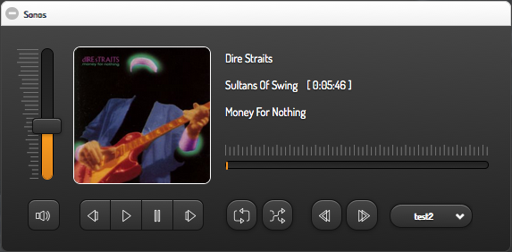

### Sonos Widget for smartVISU / FHEM

Screenshots:




Installation hints:

- tested only with smartVISU **2.8 pre** !
  - https://github.com/Martin-Gleiss/smartvisu

- Copy * to your pages folder and include *.css and *.js

- Code for your room.html or category.htm:

```


<div class="block" style="width: 100%;">
	<div class="set-4" data-role="collapsible-set" data-theme="c" data-content-theme="a" data-mini="true">
		<div data-role="collapsible" data-collapsed="false" >
		<h3>Sonos</h3>
		<table width="100%">
			<tr><td> {{ ddtlabs_sonos.sonos('sonos_spk1', 'Sonos_Spk1') }}</td></tr>
		</table>
		</div>
	</div>
</div>

```

