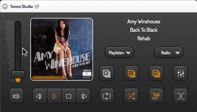

### Sonos Widget for smartVISU / FHEM

**Version: 0.85**

**Screenshots:**




**Description:**
- SmartVISU widget to control Sonos(r) speakers with FHEM/Fronthem.

**Features:**
- Control groups, play/radio lists, track position, volume, mute, play, stop, skip, ...
- Popup with equalizer and volume slider for neighbour players

**Important update note:**
- If your are updating from version **0.85** or below, you have to replace a notify and delete a userReadings definition. See change log blow.

**Requirements:**
- Fully functioning FHEM (at least version 9118, 2015-08-23) with configured Sonos modules
- SmartVISU **2.8+** (https://github.com/Martin-Gleiss/smartvisu)
- Fronthem (https://github.com/herrmannj/fronthem)
- ~~FHEM Sonos player device names without umlauts or underscores in room name. A underscore between prefix and room name is needed on the other hand.~~
~~If you are affected then rename your player(s), please. Otherwise you can try to change regexs in notifies and subs in 99_fronthemSonosUtils.pm.~~

**Installation advices:**

**FHEM:**
- Copy 99_fronthemSonosUtils.pm to your FHEM module folder (typically /opt/fhem/FHEM).
- Check that file has the same permission as all other files in this directory.
- Restart FHEM.
- **UPDATED:** Define 2 FHEM notifies (replace "Sonos_" by your used prefix, if you named it differently):
```
define n_sv_sonosGroups notify Sonos_.*[^(_LR|_RR|_LF|_RF|_SW)]:currentTrackProvider:.\w.* { sv_setSonosGroupsReadings($NAME, $EVENT) }
```
```
define n_sv_sonosTransportState notify Sonos_.*[^(_LR|_RR|_LF|_RF|_SW)]:transportState:.* { sv_SonosTransportStateChanged($NAME,$EVTPART1) }
```
- Do not forget to save.

**smartVISU:**
- Copy widget_ddtlabs_sonos.* to your smartVISU pages folder.
- Copy content of *.css and *.js to your visu.css/visu.js or include it in any other way.
- Copy sonos_empty.jpg to smartvisu_root/pages/base/pics (typically /var/www/smartvisu/pages/base/pics).
- Copy icons/.* to smartvisu ws icon folder (typically /var/www/smartvisu/icons/ws).
- Check that permissions of all copied files are correct.

**Icons:**
- Each Sonos player can build a group with its neighbours. Icons that are used for that purpose must be named in this way: my_audio_group_[playername].svg
- eg. one of your Sonos player is named "Sonos_Livingroom" then your icon for that room must be named "my_audio_group_Sonos_Livingroom.svg".
- You can use any smartVISU compatible svg icon. Some icons are included that display the first character of the room name. The character can simple be changed with a text editor of your choice (last line in svg). Position of this character can be adjusted in x/y lines above.
- Check that permissions of all copied/created files are correct.

**Widget declaration:**
```
/**
* Sonos(r) Multimedia Player
*
* @param id: unique id for this widget, no default, mandatory
* @param gad: gad name, no default, mandatory
* @param neighbors:	array of other Sonos neighbour speakers. eg: ['Sonos_Studio', 'Sonos_Wohnzimmer'], no default, optional
* @param radiolist_header: header for radio list
* @param radiolist_items: 2D array of radio display_name/sonos_favourite_name. eg. [['1LIVE','1LIVE - Das junge Radio des WDR. 103.7 (Euro-Hits)'],['Rock Ant.','ROCK ANTENNE Classic Perlen (Classic Rock)']]
* @param playlist_header: header for play list
* @param playlist_items: 2D array of play lists display_names/sonos_playlist_name. eg. [['Rock','Rock'],['New Soul','NewSoul']]
* @author dev0
*/


```

**Example widget call** for two players (eg. for rooms_*.html or category_*.html):
```
<div class="block" style="width: 100%;">
	<div class="set-1" data-role="collapsible-set" data-theme="c" data-content-theme="a" data-mini="true">
		<div data-role="collapsible" data-collapsed="false" >
		<h3>Sonos Studio <span class="sonos_header_presence"></span></h3>
		<table width="100%"><tr><td>

			{{ ddtlabs_sonos.player('sonos_studio', 'Sonos_Studio', ['Sonos_Sleepingroom', 'Sonos_Livingroom'],
			'Radio:',[
			['1LIVE','1LIVE - Das junge Radio des WDR. 103.7 (Euro-Hits)'],
			['Rock Ant.','ROCK ANTENNE Classic Perlen (Classic Rock)']
			],
			'Playlists:', [
			['Rock','Rock'],
			['New Soul','NewSoul']
			])}}

		</td></tr></table>
		</div>
	</div>
</div>

<div class="block" style="width: 100%;">
	<div class="set-1" data-role="collapsible-set" data-theme="c" data-content-theme="a" data-mini="true">
		<div data-role="collapsible" data-collapsed="false" >
		<h3>Sonos Studio <span class="sonos_header_presence"></span></h3>
		<table width="100%"><tr><td>

			{{ ddtlabs_sonos.player('sonos_sleepingroom', 'Sonos_Sleepingroom', ['Sonos_Studio', 'Sonos_Livingroom'],
			'Radio:',[
			['1LIVE','1LIVE - Das junge Radio des WDR. 103.7 (Euro-Hits)'],
			['Rock Ant.','ROCK ANTENNE Classic Perlen (Classic Rock)']
			],
			'Playlists:', [
			['Rock','Rock'],
			['New Soul','NewSoul']
			])}}

		</td></tr></table>
		</div>
	</div>
</div>
/** Note: radio stations must be added to Sonos favourites to work with FHEM's Sonos Modules */
```

- Group / ungroup your players in all possible combinations with FHEM or Sonos Controller while FHEM is running. Dynamic readings will be created.

**Fronthem converter usage:**
  - **SonosGroup:** used for all svHasClient_Sonos_.* and svIsInAnyGroup readings (these FHEM readings will automatically be created at first when Sonos speakers are grouped)
  - **SonosAlbumArtURL:** used for currentAlbumArtURL reading (inter alia fixing a FHEM Sonos module bug)
  - **SonosTrackPos:** used for svTrackPosition reading
  - **SonosTransportState:** used for transportState.* reading
  - **NumDirect:** used for Volume reading
  - **Direct:** used for all other readings
  - Some readings may not be displayed in FHEM Gad Editor because they are not on Sonos modules internal setList. Enter them nevertheless.
  - Last part of gad/items names that are displayed in gad editor are the reading names that must be selected for each reading and cmd. I hope that makes this configuration a little bit easier.

**Used Sonos player readings:**
  - can be found in the beginning of sonos player macro in widget_ddtlabs_sonos.html
  - some additional readings are created dynamically based on Sonos neighbours within Sonos players.
    - eg. svHasClient_Sonos_Livingroom, svHasClient_Sonos_Kitchen, ...

**Debugging:**
- Enable at least verbose 4 and have a look at 99_fronthemSonosUtils.pm for disabled Log3 and main::Log3 lines and enable them. reload 99_fronthemSonosUtils

**Uninstall:**
- Remove additional userReading svTrackPosition from all Sonos players (if defined in earlier version).
- Delete both created notifies within FHEM.
- Call within FHEM {sv_SonosReadingsDelete()} to delete all addional created readings within Sonos players.
- Delete all copied files.
- Say quite and sad: bye bye ;-)

**Note** on using "ddtlabs" in file names and css statements:
- I decided to use a unique prefix name to be sure to not collide with other widgets.

**ToDo:**
- Remove continously currentTrackPosition update and replace it with a timerEvent() js function. **Voluntaries up, please!**
- ~~Popup with sliders for treble, bass, balance and other settings.~~
- Get radio and play lists from FHEM readings.
- ~~Dynamic layout in width.~~

**Update notes:**
- If 99_fronthemSonosUtils.pm was replaced, then restart FHEM. "Reload 99_fronthemSonosUtils" could no be enough in some cases!
- See change log for instructions.

**Change log:**
- **1st bugfix**
- An at device was created for players that are group slaves at FHEM restart (fixed)
- FHEM requirements: min. version 9118
- Changed ongoing trackPosition update to 10sec (former 4sec)
- Immediately trackPosition update if cover image changes (new track started)
- **v0.78**
- A more dynamic layout in width.
- Added a popup with equalizer and volumes for neighbour players
- **v0.79**
- New gad-items / readings: svTransportStatePause, svTransportStatePlay, svTransportStateStop (converter: SonosTransportState)
- Current widget version can be found in popup window, too.
- UserReading definition for svTrackPosition is no longer needed. Delete it you are updating from v0.78 or below, please.
- Popup IDs were not set correctly: same popup was shown for all players (fixed)
- Minor layout changes
- **v0.80**
- Code cleanup
- **v.081**
- Slave player can control master (play,pause,stop,next,prev,trackPos)
- If player is a slave then cover art and track position will be shown from master player
- **v.082**
- SET Track Position will be redirected from slave player to master
- **v0.83**
- missed to set log level back to 4 (fixed)
- replaced multistate button by dual
- **v0.84**
- Minor changes
- **v0.85**
- Device name recognition revised, no more device name restriction!
  - **You have to adopt both notify calls**
  - See definition above.
- Master states are synced to slave players (improvement)

**Credits / Copyrights / Trademarks:**
- My wife!
- My wife!
- My wife!
- SONOS is a registered trademark of Sonos, Inc. SONOS Reg. U.S. Pat. & Tm. Off.
- FHEM: (c) Rudolf Koenig (http://www.fhem.de/fhem.html)
- Fronthem: (c) herrmannj (https://github.com/herrmannj/fronthem)
- FHEM Sonos modules: (c) Reiner Leins
- smartVISU: (c) Martin Gleiß (http://docu.smartvisu.de/2.7/index.php?page=copyright)
- Some group icons are based on icons that are published by creative commons license:
  - Credit goes to: Marek Polakovic from the Noun Project

**Have fun.**


