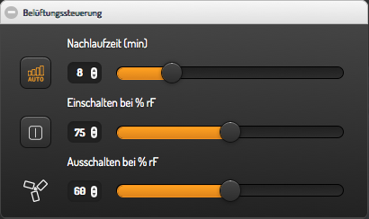
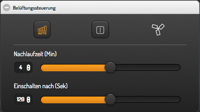

### Ventilation Control Widget for smartVISU / FHEM

Screenshots:





Installation hints:

- tested only with smartVISU **2.8 pre** !
  - https://github.com/Martin-Gleiss/smartvisu

- Copy widget_ventilation.html to your pages folder

- vent1 widget needs a fhem dummy (gad) withwith following readings:
  - attr dummy readingList rfEnable rfOn rfOff rfDiff rfStatus timerEnable timerTime timerStatus

- vent2 widget needs a fhem dummy (gad) withwith following readings:
  - attr dummy readingList timerEnable timerTime timerStatus


Code for your room.html or category.htm:

```


<div class="block">
	<div class="set-1" data-role="collapsible-set" data-theme="c" data-content-theme="a" data-mini="true">
		<div data-role="collapsible" data-collapsed="false">
		<h3>Belüftungssteuerung</h3>
		{{ ventilation.vent1('ba_fan', 'BA_FAN') }}
		</div>
	</div>
</div>

<div class="block">
	<div class="set-1" data-role="collapsible-set" data-theme="c" data-content-theme="a" data-mini="true">
		<div data-role="collapsible" data-collapsed="false">
		<h3>Belüftungssteuerung</h3>
		{{ ventilation.vent2('wc_fan', 'WC_FAN') }}
		</div>
	</div>
</div>

```

